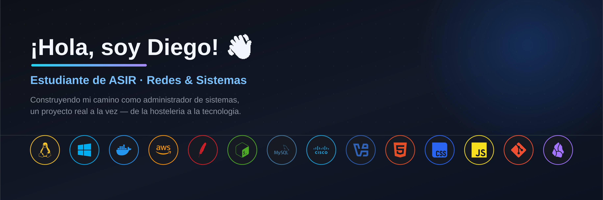

# ¡Hola! Soy Diego 👋

### Estudiante de ASIR (Administración de Sistemas Informáticos en Red)

 

 

Actualmente estoy cursando el **segundo año de ASIR**, un ciclo centrado en redes, sistemas y administración de servidores. Vengo del mundo de la hostelería y estoy haciendo el cambio hacia la informática paso a paso, construyendo una base sólida en Linux, redes y bases de datos.

Como parte de mi proceso de aprendizaje, organizo todos mis apuntes en un **vault de Obsidian** estructurado por asignaturas (Redes, Bases de Datos, Implantación de Sistemas Operativos...) y he creado material propio, como un manual unificado de comandos de Linux a partir de un curso completo en vídeo.

Mi **proyecto de fin de ciclo** es **Refúgio Atlântico**, un glamping real que estoy desarrollando junto a mi mujer en la isla de São Miguel (Azores, Portugal). Estoy llevando toda la parte técnica: una mini-web app desplegada con Docker y Apache, accesible mediante túnel Cloudflare, una base de datos con más de 30 tablas, y un sistema de control de acceso por PIN para las cerraduras inteligentes.

> 🎯 Mi objetivo: convertirme en administrador de sistemas / redes, y sacar adelante Refúgio Atlântico combinando tecnología y hostelería.

 

## 🧠 En lo que estoy trabajando

- 📚 Cursando **2º de ASIR**
- 🏕️ Desarrollando **Refúgio Atlântico**, mi proyecto de fin de ciclo: un glamping en Azores con mini-web app (Docker + Apache + túnel Cloudflare), base de datos propia y control de acceso por PIN
- 🗂️ Manteniendo mi propio **vault de conocimiento en Obsidian** con apuntes detallados por asignatura
- 🐧 Profundizando en **Linux** (elaboré un manual de +50 páginas con comandos a partir de un curso en YouTube)
- 🖥️ Administrando **servidores** (Windows Server y Linux)
- 🐳 Aprendiendo **Docker** y despliegue de aplicaciones en contenedores
- 🌐 Ampliando conocimientos de **redes** (configuración, protocolos, Cisco Packet Tracer)
- 🗃️ Diseñando y documentando **bases de datos** (SQL, esquemas relacionales)
- 💻 Practicando virtualización con **VirtualBox / VMware**

 

## 🛠️ Tecnologías y herramientas

 

## 🌍 Idiomas

 

## 📫 Redes y contacto

<!--
  Aquí puedes añadir más adelante los iconos con enlaces a tus redes,
  por ejemplo LinkedIn, Instagram, etc. Formato de ejemplo:

  
  
-->

*(próximamente)*

 

**Gracias por pasarte por mi perfil 🙌**

